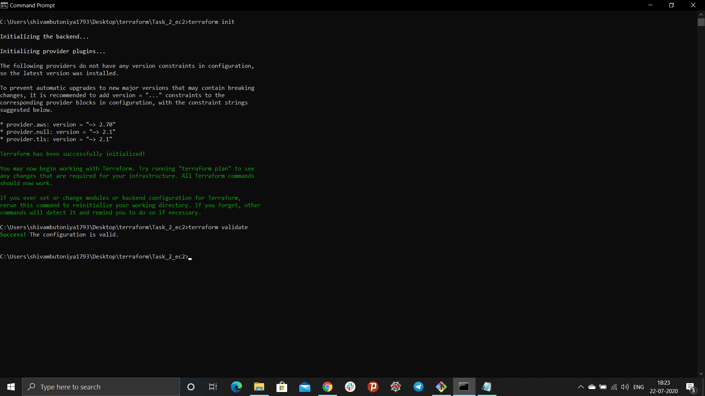
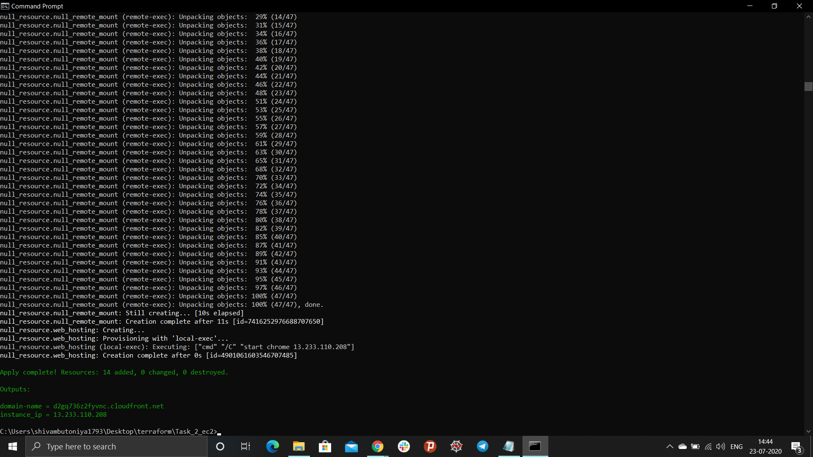
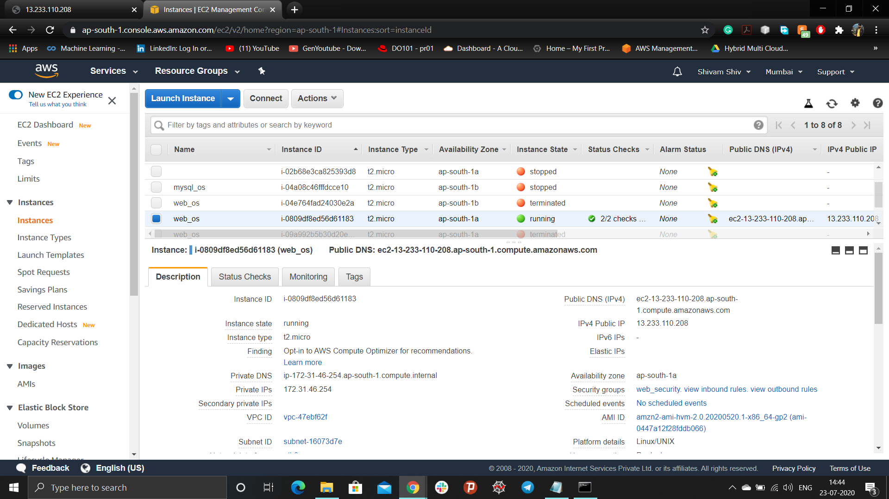
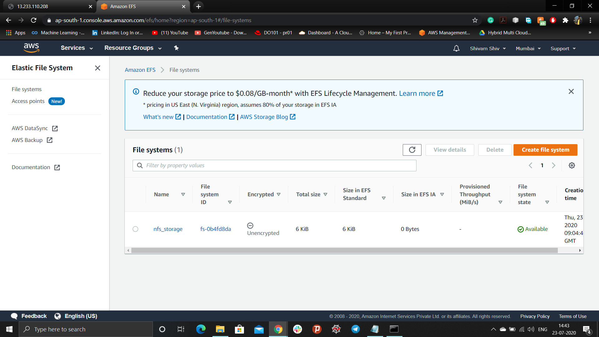
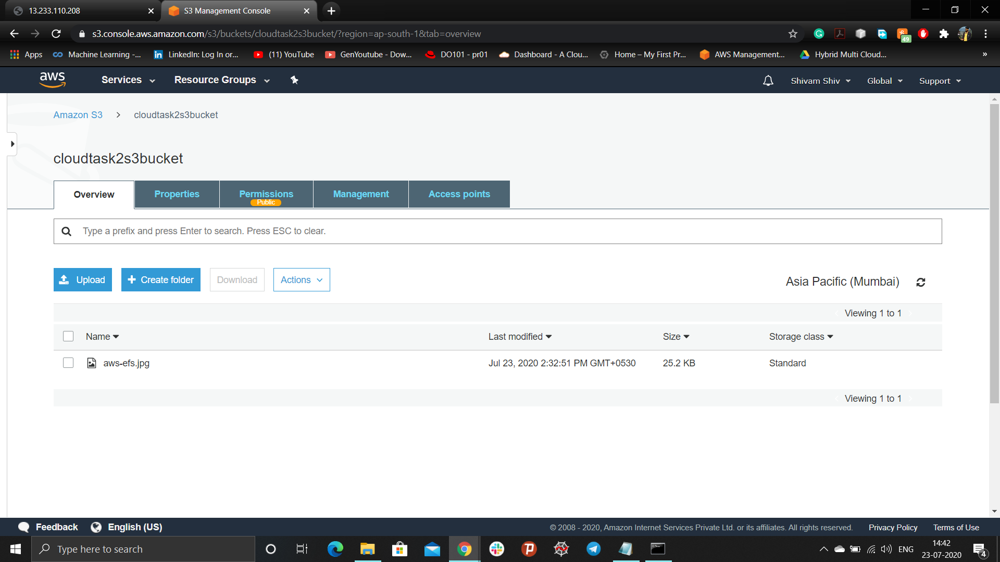
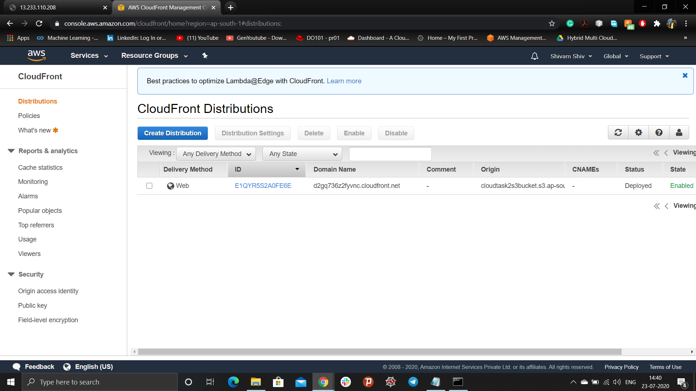
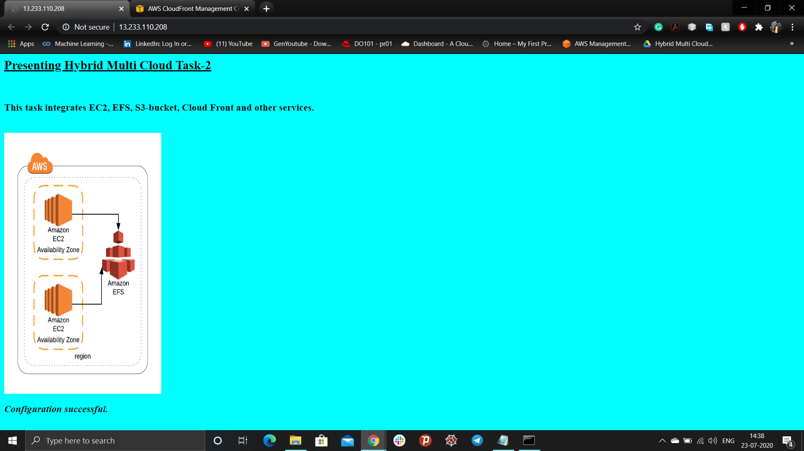
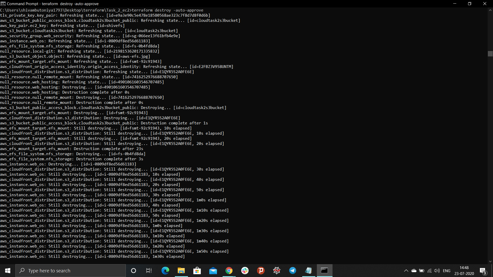
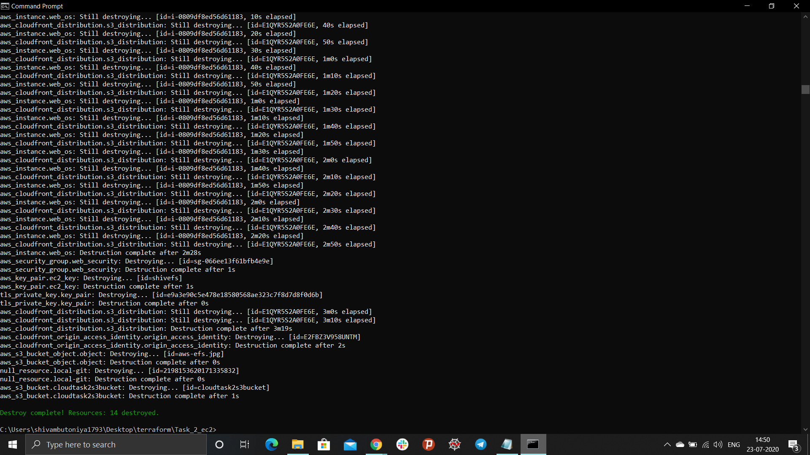

## Automate AWS services(EC2, EFS, S3, Cloud Front) using Terraform
*This project is based on automating the aws services and building infrastructure as code(IAS) using Git, AWS and Terraform. This will launch the updated website through apache webserver installed in the aws-instance which is mounted on EFS and fetching static data (i.e. images, videos etc.) from cloud-front which ultimately fetches data from aws-s3-bucket.*

### Task Synopsis
Perform the [task-1](https://github.com/Shivamshiv/multicloud) using EFS instead of EBS service on the AWS as,
Create/launch Application using Terraform
```
1. Create Security group which allows the port 80.
2. Launch EC2 instance.
3. In this Ec2 instance use the existing key or provided key and security group which we have created in step 1.
4. Launch one Volume using the EFS service and attach it in your vpc, then mount that volume into /var/www/html directory.
5. Developer have uploded the code into github repository also the repository has some images.
6. Copy the github repository code into /var/www/html directory.
7. Create S3 bucket, and copy/deploy the images from github repository into the s3 bucket and change the permission to public readable.
8 Create a Cloudfront using s3 bucket(which contains images) and use the Cloudfront URL to  update the code in /var/www/html directory.
```

### Implementing Infrastructure as code
1. Create an IAM user in aws account and download the crediantals file.
2. Run the below mentioned command on the host/windows command prompt to list the profile
```
C:\Users\shivambutoniya1793>aws configure --profile IAM_username
AWS Access Key ID [****************KTDR]:
AWS Secret Access Key [****************ZUjp]:
Default region name [ap-south-1]:
Default output format [json]:
```
> - Create a separate folder for each code and create a file with extension ".tf"
3. Specify the provider for aws and initialize region and profile.
```
provider "aws" {
  region = "ap-south-1"
  profile = "shivam"
}
```
4. Create a key which will be used for the login-authentication for the system.
```
resource "tls_private_key" "terraos_key" {
algorithm = "RSA"
}

resource "aws_key_pair" "ec2_key" {
  depends_on = [tls_private_key.key_pair]

  key_name = "shivefs"
  public_key = tls_private_key.key_pair.public_key_openssh
}
```
5. Creating security-groups for aws-instance, allowing http and ssh protocol.
> - Http works on port number 80
> - SSH works on port number 22
> - NFS works on port number 2049
```
resource "aws_security_group" "web_security" {
  depends_on = [aws_key_pair.ec2_key]

  name        = "web_security"
  description = "Allow TLS inbound traffic"

  ingress {
    description = "HTTP"
    from_port   = 80
    to_port     = 80
    protocol    = "tcp"
    cidr_blocks = ["0.0.0.0/0"]
  }
  
  ingress {
    description = "SSH"
    from_port   = 22
    to_port     = 22
    protocol    = "tcp"
    cidr_blocks = ["0.0.0.0/0"]
  }

  ingress {
    description = "NFS"
    from_port   = 2049
    to_port     = 2049
    protocol    = "tcp"
    cidr_blocks = [ "0.0.0.0/0" ]
  }

  egress {
    from_port   = 0
    to_port     = 0
    protocol    = "-1"
    cidr_blocks = ["0.0.0.0/0"]
  }

  tags = {
    Name = "web_security"
  }
}
```
6. Creating S3 Bucket and initializing it with id
> - provide unique name to the S3 bucket as each region consists unique bucket name
> - acl(access control lists) provides type of access
```
resource "aws_s3_bucket" "cloudtask2s3bucket" {
  bucket        = "cloudtask2s3bucket"
  acl           = "public-read"
  region        = "ap-south-1"
  force_destroy = true

  tags = {
    Name = "my_bucket"
    Environment = "Deployment"
  }
}
```
7. Downloading git repository in local system using null resource
```
resource "null_resource" "local-git" {
  depends_on = [aws_s3_bucket.cloudtask2s3bucket]  

  provisioner "local-exec" {
    command = "git clone https://github.com/Shivamshiv/AWS_Cloud_EFS"
  }
}
```
8. Uploading static file(images, videos) to s3-bucket
```
resource "aws_s3_bucket_object" "object" {
  depends_on = [aws_s3_bucket.cloudtask2s3bucket, null_resource.local-git] 

  bucket = aws_s3_bucket.cloudtask2s3bucket.id
  key    = "aws-efs.jpg"
  source = "AWS_Cloud_EFS/aws-efs.jpg"
  acl = "public-read"
}
```
9. Manages S3 bucket-level Public Access Block configuration and provides settings for access points, buckets, and accounts to help you manage public access to Amazon S3 resources
```
resource "aws_s3_bucket_public_access_block" "cloudtask2s3bucket_public" {
  bucket = "cloudtask2s3bucket"
  block_public_acls   = false
  block_public_policy = false
}
```
10. Creating origin access identity
```
resource "aws_cloudfront_origin_access_identity" "origin_access_identity" {
  depends_on = [aws_s3_bucket_object.object]
  comment = "Cloud Task 2"
}
```
11. Creating cloud-front distribution and connecting it to the S3 bucket
```
resource "aws_cloudfront_distribution" "s3_distribution" {
  depends_on = [aws_s3_bucket.cloudtask2s3bucket, null_resource.local-git]

  origin {
    domain_name = aws_s3_bucket.cloudtask2s3bucket.bucket_regional_domain_name
    origin_id   = "S3-cloudtask2s3bucket"

    s3_origin_config {
      origin_access_identity = aws_cloudfront_origin_access_identity.origin_access_identity.cloudfront_access_identity_path
    }
  }

  enabled             = true
  is_ipv6_enabled     = true

  default_cache_behavior {
    allowed_methods  = ["DELETE", "GET", "HEAD", "OPTIONS", "PATCH", "POST", "PUT"]
    cached_methods   = ["GET", "HEAD"]
    target_origin_id = "S3-cloudtask2s3bucket"

    forwarded_values {
      query_string = false

      cookies {
        forward = "none"
      }
    }

    viewer_protocol_policy = "allow-all"
    min_ttl                = 0
    default_ttl            = 3600
    max_ttl                = 86400
  }

  restrictions {
    geo_restriction {
      restriction_type = "none"
    }
  }

  viewer_certificate {
    cloudfront_default_certificate = true
  }
}
```
12. Printing Cloud-front domain name
```
output "domain-name" {
  value = aws_cloudfront_distribution.s3_distribution.domain_name
}
```
13. Launching EC2 instance
> - provide ami id (i.e. unique for each os images)
> - instance type (resources i.e. RAM, CPU etc.)
> - connection is used to provide the connection to the instance
> - Remotely installing the apache-webserver(httpd), php, git, nfs-utils and amazon-efs-utils to the instance
```
resource "aws_instance" "web_os" {
  depends_on = [aws_security_group.web_security]

  ami           = "ami-0447a12f28fddb066"
  instance_type = "t2.micro"
  key_name = aws_key_pair.ec2_key.key_name
  security_groups = [ "web_security" ]

  connection {
    type   = "ssh"
    user   = "ec2-user"
    private_key = tls_private_key.key_pair.private_key_pem
    host   = aws_instance.web_os.public_ip
  }

  provisioner "remote-exec" {
    inline = [
      "sudo yum update -y",
      "sudo yum install amazon-efs-utils nfs-utils -y",
      "sudo yum install httpd  php git -y",
      "sudo systemctl restart httpd",
      "sudo systemctl enable httpd",
    ]
  }

  tags = {
    Name = "web_os"
  }
}
```
14. Provides an Elastic File System (EFS).
```
resource "aws_efs_file_system" "nfs_storage" {
  depends_on = [aws_security_group.web_security, aws_instance.web_os]

  creation_token = "nfs_storage"
  performance_mode = "generalPurpose"
  throughput_mode = "bursting"
  tags = {
    Name = "nfs_storage"
  }
}
```
15. Provides an Elastic File System (EFS) mount target.
```
resource "aws_efs_mount_target" "efs_mount" {
  depends_on = [aws_efs_file_system.nfs_storage]

  file_system_id = aws_efs_file_system.nfs_storage.id
  subnet_id      = aws_instance.web_os.subnet_id
  security_groups = ["${aws_security_group.web_security.id}"]
}
```
16. Printing Instance public IP
```
output "instance_ip" {
  value = aws_instance.web_os.public_ip
}
```
17. Mounting EFS to the web hosting directory /var/www/html and updating the image source to the cloud-front domain-name in the index.html file.
```
resource "null_resource" "null_remote_mount"  {
  depends_on = [aws_efs_mount_target.efs_mount]

  connection {
    type     = "ssh"
    user     = "ec2-user"
    private_key = tls_private_key.key_pair.private_key_pem
    host     = aws_instance.web_os.public_ip
  }

  provisioner "remote-exec" {
    inline = [
      "sudo echo ${aws_efs_file_system.nfs_storage.dns_name}:/var/www/html efs defaults,_netdev 0 0 >> sudo /etc/fstab",
      "sudo mount  ${aws_efs_file_system.nfs_storage.dns_name}:/  /var/www/html",
      "sudo git clone https://github.com/Shivamshiv/AWS_Cloud_EFS /var/www/html/",
      "sudo sed -i 's@$aws-efs.jpg@https://${aws_cloudfront_distribution.s3_distribution.domain_name}/aws-efs.jpg@g'  /var/www/html/index.html ",
      "sudo systemctl restart  httpd"
    ]
  }
}
```
18. Web hosting of the server which is launched on chrome browser
```
resource "null_resource" "web_hosting" {
  depends_on = [null_resource.null_remote_mount]

  provisioner "local-exec" {
    command = "start chrome ${aws_instance.web_os.public_ip}"
  }
}
```
19. Now, run the file ec2_efs.tf infrastructure as a code file in the cmd.
> - terraform validate (to validate the syntax of the code)
> - terraform init (to install the required plugins)



> - terraform apply -auto-approve(to deploy the infrastructure as code)



> - AWS-EC2 instances, web_os created by the ec2_efs.tf code.



> - EFS created by the code.



> - S3 bucket created the code.



> - Cloud-front created by the code.



> - Finally, web page is hosted on the apache web server



20. To destroy the entire infrastructure created on the AWS
> - terraform destroy -auto-approve





**Thanks for the reading.**
